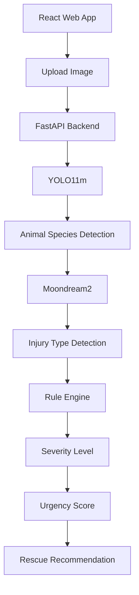

# 🐾 AI Stray Animal Rescue Platform

An AI-powered, web-based stray animal rescue and triage system — college final year project.

---

## 📋 Features

- 📸 **Photo upload** with drag-and-drop interface
- 📍 **GPS capture** from browser Geolocation API
- 🤖 **AI triage** — YOLO11m (species) + Custom YOLOv8 (injury) + Area-Ratio Severity Algorithm
- 🔢 **Urgency Score (0–100)** with 5 priority tiers
- 📧 **Email alert** to nearest NGO via SendGrid *(optional)*
- ⚙️ **Admin dashboard** with charts, filterable reports table, and inline status updates
- 🔒 **JWT authentication** with citizen / NGO admin / super admin roles

---

## 🗂️ Project Structure

```
AI_Stray_Animal_Rescue/
├── README.md
├── AI_Stray_Animal_Rescue_Project.md   ← Full project documentation
│
├── backend/
│   ├── .env.example                    ← Copy to .env and fill in
│   ├── requirements.txt
│   └── app/
│       ├── main.py                     ← FastAPI entry point
│       ├── config.py                   ← Env/settings (Pydantic)
│       ├── database.py                 ← MongoDB + Beanie init
│       ├── models/                     ← User, Report, NGO documents
│       ├── routers/                    ← auth, reports, admin endpoints
│       ├── services/                   ← ml_inference, urgency_score,
│       │                                  cloudinary_svc, email_svc
│       ├── schemas/                    ← Pydantic request/response models
│       └── core/auth.py               ← JWT + bcrypt helpers
│
└── frontend/
    ├── index.html
    ├── package.json
    ├── vite.config.js
    └── src/
        ├── pages/                      ← Home, Auth, Report, MyReports,
        │                                  AdminDashboard
        ├── components/                 ← Navbar, Badges
        ├── context/AuthContext.jsx     ← Login/logout state
        ├── services/api.js             ← Axios client (JWT interceptor)
        ├── App.jsx                     ← Router + protected routes
        └── index.css                   ← Dark-mode design system
```

---

## 🚀 Local Setup

### Prerequisites
- Python 3.10+
- Node.js 20+
- MongoDB Atlas free M0 cluster
- Cloudinary free account

### 1. Backend

```bash
cd backend

# Create & activate virtual environment
python -m venv venv
venv\Scripts\activate          # Windows
# source venv/bin/activate     # macOS/Linux

# Install dependencies
pip install -r requirements.txt

# Configure environment
copy .env.example .env          # Windows
# cp .env.example .env          # macOS/Linux
# → fill in the .env values (see table below)

# Start the server
uvicorn app.main:app --reload --port 8000
```

📖 Interactive API docs: **http://localhost:8000/docs**

### 2. Frontend

```bash
cd frontend
npm install
npm run dev
```

🌐 Open: **http://localhost:5173**

---

## ⚙️ Environment Variables (`.env`)

| Variable | Required | Description |
|---|---|---|
| `MONGODB_URI` | ✅ | MongoDB Atlas connection string |
| `SECRET_KEY` | ✅ | Any random string for JWT signing |
| `CLOUDINARY_CLOUD_NAME` | ✅ | From Cloudinary dashboard |
| `CLOUDINARY_API_KEY` | ✅ | From Cloudinary dashboard |
| `CLOUDINARY_API_SECRET` | ✅ | From Cloudinary dashboard |
| `SENDGRID_API_KEY` | ⬜ Optional | Leave empty to skip email alerts |
| `FROM_EMAIL` | ⬜ Optional | Verified sender for SendGrid |
| `YOLO_MODEL_PATH` | ⬜ Optional | Path to YOLO11 species model (`yolo11m.pt`) |
| `EFFNET_MODEL_PATH` | ⬜ Optional | Path to Custom YOLO injury model (`best_injury.pt`) |
| `FRONTEND_URL` | ⬜ Optional | For CORS + email links |

> **No trained models?** The system auto-downloads `yolo11m.pt` from Ultralytics and uses a visual heuristic for injury scoring — works great for demos.

---

## 🤖 AI Pipeline Architecture



**Rule Engine Severity Mapping:**
Instead of bounding box heuristics, we use a deterministic rule engine to map specific medical conditions (detected by Moondream2 offline) to a Base Severity Level:

| Tier | Base Score | Conditions | Action |
|---|---|---|---|
| ⚪ **MONITOR** | 0 | `healthy`, `old_scar`, `minor_hair_loss`, `resting_animal`, etc. | Log only |
| 🟢 **LOW** | 25 | `minor_skin_disease`, `small_wound`, `mild_limping`, etc. | Schedule patrol |
| 🔵 **MEDIUM** | 50 | `moderate_wound`, `eye_infection`, `unable_to_use_one_leg`, etc. | Within 4 hours |
| 🟠 **HIGH** | 75 | `deep_wound`, `severe_burn`, `large_open_wound`, etc. | Within 1 hour |
| 🔴 **CRITICAL** | 100 | `fracture`, `heavy_bleeding`, `road_accident`, `hit_by_vehicle` | Dispatch immediately |

### Model Resilience & Fallback Engine
Because Small Vision-Language Models (like the 1.8B Moondream2) struggle with strict JSON formatting and exact keyword matching, this pipeline implements several custom resilience techniques:
- **Chain of Thought Prompting:** The Severity Tier table is injected directly into Moondream's prompt. This forces the AI to reason about the *Severity Level* first, dramatically improving the accuracy of its *Injury Description*.
- **Smart Natural Language Extraction:** If the model outputs a conversational caption instead of JSON, a heuristic engine scans the text for synonyms (e.g. mapping "burn" to `severe_burn` or "bitten" to `small_wound`).
- **Dynamic Confidence Scoring:** During fallback extraction, the confidence score is dynamically assigned based on keyword severity (e.g., 98% for "critical/dying", 90% for "healthy", 65% for vague terms like "sick").
- **Species Override:** YOLO is trained on the COCO dataset, which lacks certain species (e.g., Lions are often misclassified as Bears). If Moondream identifies a specific unlisted animal in its text analysis, its prediction intelligently overrides YOLO.

### Urgency Score Formula
```
score = injury_weight × confidence_factor + time_bonus + juvenile_bonus

Tiers:
  90–100 → 🔴 CRITICAL  (dispatch immediately)
  70–89  → 🟠 HIGH      (within 1 hour)
  40–69  → 🔵 MEDIUM    (within 4 hours)
  10–39  → 🟢 LOW       (schedule patrol)
  0–9    → ⚪ MONITOR   (log only)
```

### Scalability (YOLO11-Seg Architecture)
The system's architecture is built to seamlessly scale to **YOLO11-Seg (Instance Segmentation)**. When a Polygon-labeled dataset of 5,000+ medical images is acquired, the injury detection model can be swapped out to output pixel-perfect segmentation masks of wounds without changing the backend logic.

---

## 📦 Key Dependency Pins

These versions are pinned in `requirements.txt` to avoid known conflicts:

| Package | Pin | Reason |
|---|---|---|
| `pymongo` | `==4.7.3` | motor 3.3.2 breaks with pymongo 4.9+ |
| `pydantic` | `[email]==2.6.0` | includes `email-validator` |
| `bcrypt` | `==4.0.1` | passlib breaks with bcrypt 4.1+ |
| `numpy` | `<2` | torch 2.2.0 compiled against NumPy 1.x |

---

## 🌐 Free Deployment

| Service | Platform |
|---|---|
| Backend | [Render.com](https://render.com) (free tier) |
| Frontend | [Vercel](https://vercel.com) (free tier) |
| Database | [MongoDB Atlas](https://mongodb.com/atlas) (free M0) |
| Images | [Cloudinary](https://cloudinary.com) (free 25 GB) |
| Email | [SendGrid](https://sendgrid.com) (free 100/day) |

**Total monthly cost: ₹0**

---

## 👤 Creating an Admin Account

Register a normal account, then update the role directly in MongoDB Atlas:

```javascript
db.users.updateOne(
  { email: "admin@example.com" },
  { $set: { role: "super_admin" } }
)
```

Or use the API: `PATCH /api/v1/admin/users/{id}/role` (requires existing super_admin token).

---

*Built by Aman | AI + Web Developer | College Final Year Project 2026*
